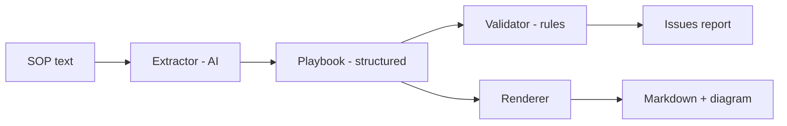

# Playbook Forge

**Turn contact-centre SOPs into structured, compliance-checked agent-assist
playbooks — automatically.**

Agent-assist tools (Cresta, Kore.ai, Genesys, NICE, Cognigy, …) guide human
contact-centre agents through procedures called **playbooks**. Building those
playbooks is slow, manual, design-time work: analysts hand-translate long policy
documents (SOPs) into steps, and compliance reviews every one. That manual effort
is the main thing delaying **time-to-value**.

This project attacks exactly that step. Feed it an SOP; it produces a structured,
ordered playbook with:

- **A citation** back to the exact SOP sentence behind every step (so a human can
  approve in minutes instead of authoring for hours), and
- **An automated compliance check** that *proves* mandatory steps — identity
  verification, OTP confirmation — happen in the right order on every path.

It is a **draft factory with a safety net**, not a replacement for human review.

---

## New here? Read the from-scratch guide (built for AI PM interview prep)

If you're new to AI or to this domain, read these in order. They assume **zero**
prior knowledge and build up to interview-ready fluency:

1. [`docs/01-what-is-agent-assist.md`](docs/01-what-is-agent-assist.md) — the
   problem space, in plain English.
2. [`docs/02-what-are-playbooks.md`](docs/02-what-are-playbooks.md) — what a
   playbook actually is (with pictures).
3. [`docs/03-how-the-pipeline-works.md`](docs/03-how-the-pipeline-works.md) — how
   the system works, stage by stage.
4. [`docs/04-ai-pm-interview-guide.md`](docs/04-ai-pm-interview-guide.md) —
   likely interview questions + strong answers.
5. [`docs/05-competitive-landscape.md`](docs/05-competitive-landscape.md) — the
   market and how to talk about it.
6. [`docs/06-evaluation-and-the-runtime-agent.md`](docs/06-evaluation-and-the-runtime-agent.md)
   — how to *evaluate* the product, and how the run-time agent + guardrail work.
7. [`docs/07-owning-the-product.md`](docs/07-owning-the-product.md) — **the mastery
   doc:** every decision through What / How / Why / What-if-we-don't, plus a
   hard-questions Q&A. Study this to defend the whole product.
8. [`docs/08-dynamic-sops-and-sales-playbooks.md`](docs/08-dynamic-sops-and-sales-playbooks.md)
   — auto-syncing playbooks when SOPs change, and generalising to sales playbooks.

---

## The pipeline



Only the **extractor** uses AI (Claude). The **validator** is deliberately plain,
rule-based code — because compliance checks must be repeatable and explainable to
an auditor.

| File | Role |
|---|---|
| `playbook_forge/schema.py` | The canonical playbook shape (the contract everything relies on). |
| `playbook_forge/extractor.py` | AI step: SOP text → structured playbook (Claude, schema-enforced). |
| `playbook_forge/validator.py` | Deterministic compliance + structural checks (incl. gate-ordering proof). |
| `playbook_forge/renderer.py` | Playbook → human-review Markdown + Mermaid flow diagram. |
| `playbook_forge/cli.py` | Runs the whole design-time pipeline from one command. |
| `playbook_forge/engine.py` | **Run-time guardrail:** enforces gate ordering during a live conversation. |
| `playbook_forge/agent.py` | The agent: an LLM decision-maker (live) + scripted policies for evaluation. |
| `playbook_forge/simulator.py` | Drives simulated conversations through the engine and scores them. |
| `playbook_forge/evaluate.py` | The evaluation harness (extraction quality + behavioural safety). |
| `playbook_forge/sync.py` | **Dynamic sync:** diffs a re-extracted playbook vs the old one and routes gate-touching changes to human review. |
| `examples/` | A realistic messy SOP + its structured playbook. |
| `tests/` | Proves the pipeline works *and* that the safety net catches breaches. |

The validator also **verifies citations** against the source SOP: pass the SOP
text and any fabricated ("hallucinated") citation becomes a hard error.

---

## Run it

```bash
pip install -r requirements.txt

# Offline demo — runs the full pipeline with the bundled block-card example,
# no API key needed. Great for seeing the whole thing work.
python -m playbook_forge.cli examples/block_card_sop.txt --no-ai

# Write outputs (playbook.json / .md / .mmd) to a folder:
python -m playbook_forge.cli examples/block_card_sop.txt --no-ai --out build/

# Live mode — real extraction on ANY SOP. Needs an Anthropic API key:
export ANTHROPIC_API_KEY=sk-ant-...
python -m playbook_forge.cli path/to/your_sop.txt --out build/
```

Evaluate it — extraction quality **and** run-time safety (offline, no key):

```bash
python -m playbook_forge.evaluate
```

This drives simulated conversations through the playbook, including an
**adversarial agent that tries to skip the OTP** — and shows the engine blocking
it while the conversation still finishes safely.

See auto-sync decide what's safe when an SOP changes (offline, no key):

```bash
python -m playbook_forge.sync
```

Cosmetic edits on non-gate steps → auto-apply; anything touching a compliance gate
→ routed to human review.

Run the tests (includes the flagship "dropped OTP gate is caught" checks):

```bash
PYTHONPATH=. python tests/test_pipeline.py     # design-time checks + citation verification
PYTHONPATH=. python tests/test_engine.py       # run-time guardrail checks
PYTHONPATH=. python tests/test_sync.py         # dynamic-sync routing checks
# or, if pytest is installed:  python -m pytest -q
```

---

## The flagship idea in one paragraph

An SOP is prose written for humans; a computer can't act on prose. We define a
strict **schema** (the shape of a valid playbook), use an LLM with
**structured outputs** to force the messy SOP into that shape, then run a
**deterministic validator** that mathematically proves compliance gates sit on
*every* path to the actions they guard (dominator analysis). The result is a
**cited, verifiable draft** a human approves in minutes. AI for the creative step,
deterministic rules for the safety step, humans for accountability.

---

## What this is / isn't

- **Is:** a design-time tool that manufactures reviewable playbook drafts from SOPs.
- **Isn't:** the real-time agent panel, and isn't an auto-publish-to-production
  system. Everything ends at *a reviewed draft* — on purpose.

Built as a learning + prototype project. Model: `claude-opus-4-8` via the official
Anthropic SDK.
