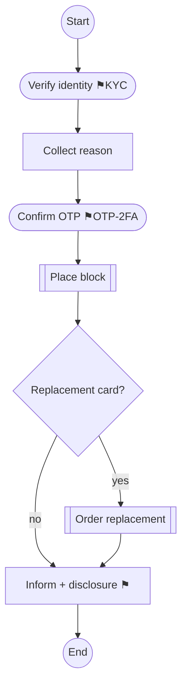

# 2. What exactly is a playbook?

## The everyday analogy

A playbook is a **recipe**. A recipe isn't a vague paragraph about cooking; it's
an ordered list of concrete steps ("1. preheat oven, 2. mix flour and eggs,
3. bake for 20 min"), and some steps have rules ("you must let the dough rest
*before* baking"). A playbook is the same idea, for a customer-service procedure.

## The "block my card" example, in plain English

Imagine you call the bank to block a stolen card. A good procedure is:

1. **Verify** who you are (name, date of birth, last 4 digits) — *don't do
   anything until this passes*.
2. **Collect** the reason (lost? stolen? fraud?).
3. **Confirm** a one-time passcode (OTP) sent to your phone — *mandatory, cannot
   be skipped*.
4. **Action:** actually place the block (this is irreversible).
5. **Branch:** ask if you want a replacement card. Yes → order it. No → skip.
6. **Inform:** tell you the block is active and read the fraud disclosure.

Notice three things — these are the reason a playbook is more than a checklist:

- **Order matters.** You cannot place the block (step 4) before confirming the
  OTP (step 3). Doing so is a *compliance breach*.
- **Some steps are gates.** Steps 1 and 3 are legally required and audited.
- **There are branches.** Step 5 splits the path depending on the answer.

## So a playbook is a *graph*, not a list

Because of branches, a playbook isn't a straight line — it's a **flowchart**
(computer scientists call it a *directed graph*): boxes (steps) connected by
arrows (what comes next), with diamonds where the path splits.

Here's the block-card playbook drawn as one:

The red-outlined boxes (⚑) are **compliance gates**. The diamond is a **branch**.
That picture *is* the playbook — our software's job is to produce it, correctly,
from the messy SOP document.

## Why not just let the AI answer freely instead of using playbooks?

Great interview question to anticipate. In a *casual* setting (a general chatbot),
free-form AI is fine. In a *regulated* setting it is not, for three reasons:

1. **Guarantees.** A playbook lets you *prove* "the block never happens before the
   OTP." You can't prove that about a free-form model's behaviour.
2. **Auditability.** Regulators ask "show me your procedure." A playbook is a
   concrete artifact you can hand over. "The AI decided" is not.
3. **Consistency.** Every agent, every call, follows the same vetted steps —
   instead of each depending on the model's mood that day.

Playbooks are how you get the *speed* of AI **and** the *control* regulators
demand. That tension — speed vs. control — is the theme of this entire product.

## The seven step-types we use

To force every SOP into one consistent vocabulary, we say every step is exactly
one of these. (This is defined in code in `playbook_forge/schema.py`.)

| Type | What it means | Card example |
|---|---|---|
| **verify** | Confirm identity/eligibility | Verify caller's identity |
| **collect** | Gather info from the customer | Ask the reason for blocking |
| **confirm** | Get explicit agreement/acknowledgement | Confirm the OTP |
| **action** | Do something in a backend system | Place the block |
| **branch** | A decision point that splits the path | Replacement card? |
| **inform** | Tell the customer something | Read the disclosure |
| **escalate** | Hand off to a human specialist | Failed-verification handoff |

Constraining the world to seven types is a **product decision**: it's what makes
playbooks from totally different SOPs comparable, checkable, and automatable.

→ Next: [`03-how-the-pipeline-works.md`](03-how-the-pipeline-works.md)
