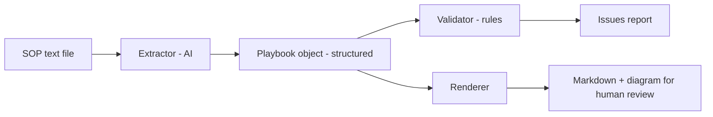

# 3. How the system works, piece by piece

This explains the actual machine we built. Each stage maps to one file in
`playbook_forge/`. No prior coding knowledge assumed — we explain the *why*.

## The pipeline at a glance



Read it left to right: messy document in → AI turns it into structure → we check
the structure → we render it for a human to approve. Four stages. Only **one** of
them (the extractor) uses AI. That's deliberate — see stage 3.

---

## Stage 0: the schema — the shape everything must fit
**File: `playbook_forge/schema.py`**

Before anything, we define what a valid playbook *is*: an object with an intent, a
list of steps, each step having a type, guidance text, preconditions, a citation,
and so on. We write this as Python classes using a library called **pydantic**.

Why this comes first: a schema is a **contract**. Every other stage relies on it.
The AI is told "your answer must match this contract." The validator checks
things "at the positions the contract guarantees." The renderer reads fields "it
knows exist." Get the schema right and everything downstream becomes simple.

**The single most important field is `source_citation`** — the exact SOP sentence
each step came from. It's what makes a human trust the draft (see stage 4).

---

## Stage 1: the extractor — the only AI in the system
**File: `playbook_forge/extractor.py`**

This is where a **Large Language Model (LLM)** — Claude — reads the SOP and
produces a draft playbook.

### What's an LLM, in one paragraph?
A Large Language Model is a program trained on enormous amounts of text that,
given some input text, predicts sensible output text. Modern ones (like Claude)
are good at *reading messy prose and reorganising it* — which is exactly what
turning an SOP into steps requires. You don't program the rules; you *describe the
task* in plain language (a **prompt**) and the model does it.

### The critical technique: structured outputs
A naive approach is: "Claude, write me a playbook" → it writes paragraphs → we try
to parse paragraphs. That's fragile and breaks constantly.

Instead we use **structured outputs**: we hand the model our exact JSON schema and
the API *forces* the response to be JSON matching that schema. So the model can't
return prose or malformed data — it returns something our code can load directly.
**This is the technique that turns an LLM from a chatbot into a reliable software
component.** Remember this for interviews; it's a frequent "how do you make LLMs
production-safe?" answer.

### The prompt does the real work
Look at `_SYSTEM_PROMPT` in the file. In plain English it tells the model:
"break the SOP into atomic steps; preserve order and gates; tag compliance steps;
cite the verbatim sentence for each step; don't invent anything." **Prompt design
is product design here** — those instructions are where our domain expertise about
regulated flows gets encoded.

### Offline mode
This repo runs without an API key by loading a pre-computed block-card playbook.
That's purely so you can *see the whole pipeline work* as a demo. With a real key,
the extractor calls Claude and does genuine extraction on any SOP you feed it.

---

## Stage 2 & 3: validate — the safety net (NO AI here)
**File: `playbook_forge/validator.py`**

After the AI drafts a playbook, we do **not** trust it. We run a set of plain,
rule-based checks. Deliberately *not* AI — because for compliance you want checks
that are 100% repeatable and explainable to a regulator.

The checks, in plain terms:

- **NO_ENTRY / DANGLING_EDGE:** does the flow actually connect up, or does it point
  at steps that don't exist? (structural sanity)
- **UNREACHABLE:** are there steps you can never actually reach? Dead procedure.
- **UNREACHABLE_GATE:** worse — is a *required compliance step* unreachable? That's
  an error: a legal step that can never run.
- **GATE_ORDER (the flagship):** for every step that claims "X must happen before
  me," we mathematically prove X happens first *on every possible path*. This is
  the check that catches "the block can be placed without confirming the OTP" —
  a reportable compliance breach.

### How GATE_ORDER actually proves ordering
It uses a classic graph algorithm called **dominator analysis**. In plain terms: a
step D "dominates" step S if there is *no way* to get from Start to S without
passing through D. If the OTP step dominates the block step, then confirming the
OTP is *guaranteed* before blocking — on every path, no exceptions. If a declared
precondition does **not** dominate the step, we raise GATE_ORDER. You don't need
the math for an interview; you need the sentence: *"we prove the gate lies on
every path to the action, not just some of them."*

Each issue has a **severity**: ERROR (must fix), WARNING (human should look), INFO
(worth noting). The command-line tool exits with a failure code if there are any
ERRORs — so this can plug into an automated review gate.

---

## Stage 4: the renderer — make it reviewable by a human
**File: `playbook_forge/renderer.py`**

A playbook as JSON is great for machines and unreadable for the SME who must
approve it. The renderer turns it into:

- **Markdown:** each step, its guidance, its compliance tag, and — crucially — the
  verbatim SOP sentence it came from.
- **A Mermaid flow diagram:** the picture, with compliance gates outlined in red.

**Why citations matter here:** the reviewer's job changes from *authoring* (reading
the whole policy and building steps from scratch — hours) to *approving* (checking
each step against the sentence it cites — minutes). That shift is where the
design-time savings actually come from. The AI didn't just save typing; it changed
the human's task from "write" to "verify."

---

## Stage 5: the CLI — glue it together
**File: `playbook_forge/cli.py`**

One command runs all of the above: read SOP → extract → validate → render → report.
```
python -m playbook_forge.cli examples/block_card_sop.txt --no-ai
```

## The human is still in the loop — on purpose

Notice what we did **not** build: an "AI that pushes playbooks straight to
production." Everything ends at *a reviewed draft*. In regulated work, "human in
the loop" isn't a limitation to remove — it's a feature you sell. The value is
that the human's job went from hours of authoring to minutes of approving, not
that the human disappeared.

→ Next: [`04-ai-pm-interview-guide.md`](04-ai-pm-interview-guide.md)
