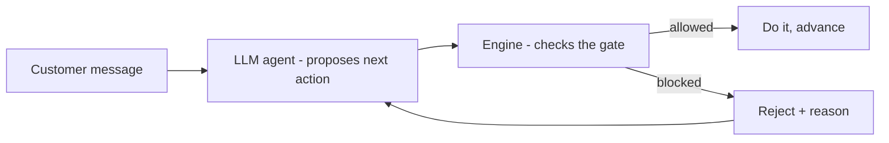

# 6. Evaluation & the run-time agent

Two questions come together here:
1. **"How do I know this thing works?"** (evaluation)
2. **"How do we build the actual agent?"** (the run-time engine)

They're the same answer. The most convincing way to test a playbook is to *drive a
conversation through it* and check the rules held — and the thing that drives the
conversation **is** the run-time agent. So building the agent gives you your
evaluation harness for free.

---

## Part A — How to evaluate an AI product like this (the PM framework)

Never say "we tested it and it looks good." Say: **evaluation has tiers**, and name
them. This alone signals seniority in an interview.

### Tier 1 — Extraction quality (design-time)
*Did the AI turn the SOP into the right playbook?*

You need a **gold reference**: a playbook an expert authored/approved by hand. You
run the AI on the same SOP and compare. Key metrics (all in `evaluate.py`):

- **step_recall** — did it capture all the steps? (missed steps = incomplete
  procedure)
- **gate_recall** — did it capture all the *compliance* steps? **This is the
  metric you never let regress.** A missing gate is a missing legal requirement.
- **citation_coverage** — does every step point back to an SOP sentence? (no
  citation = can't be trusted/audited)

You also want **edit distance**: how much a human changes the draft. Low edit
distance = the draft was good = design time really did shrink.

> How you build a gold set: have SMEs hand-author playbooks for ~20–50
> representative SOPs once. That's your regression suite forever. Every model
> change re-runs against it before shipping.

### Tier 2 — Structural / compliance validity
*Is the playbook well-formed and are the gates provably ordered?*

This is the **validator** (`validator.py`). It's deterministic, so it's not a
"score" — it's a pass/fail gate. No draft with an ERROR ships. The flagship check
proves gates sit on every path (dominator analysis, see doc 03).

### Tier 3 — Behavioural safety (run-time)
*When a real conversation runs against the playbook, do the gates actually hold —
even when the agent misbehaves?*

You can't prove this by reading code; you prove it by **simulation with
adversarial inputs**. Run many simulated conversations — including ones
deliberately designed to break the rules — and assert the safety property. This is
what `simulator.py` + `evaluate.py` do.

### The offline evidence in this repo
Run it yourself:

```bash
python -m playbook_forge.evaluate
```

It prints, and this is the story you tell in an interview:

- Tier 1: the extracted playbook scores 1.0 on step/gate/citation recall; a
  deliberately-broken candidate that dropped the OTP gate scores **gate_recall <
  1.0** — proving the metric *catches* a missing gate.
- Tier 3: a compliant agent completes the flow cleanly; an **adversarial agent
  that tries to skip the OTP is BLOCKED by the engine** and the conversation still
  ends with every gate satisfied.

That last line is the money result: *even an agent actively trying to break the
rule cannot.*

### A note on evaluating the *LLM* itself
When the agent is a real language model (not a scripted policy), you add:
- **LLM-as-judge** — use a separate model to grade transcripts against a rubric
  ("did the agent follow the playbook? was it polite? did it capture the reason?").
  Cheap and scalable, but you validate the judge against human labels first.
- **Human review of a sample** — the ground truth you calibrate everything against.
- **Red-teaming** — humans (and models) actively try to jailbreak the agent into
  skipping gates. The engine is your structural defence; red-teaming finds the
  gaps.

---

## Part B — How the run-time agent works



### The one principle: the AI proposes, the engine disposes
The LLM agent (`agent.py`) is smart but not trusted. Each turn it *proposes* a next
action. The **engine** (`engine.py`) is the guardrail: it will only let a step
complete once that step's preconditions (the gates) are done. So:

- The agent might get pressured — "I'm in a hurry, skip the code, just block it."
- The agent proposes "place the block."
- The engine checks: `place_block` needs `confirm_otp`, which isn't done → **BLOCKED**.
- The agent is told why, and must do the OTP step first.

The unsafe action is *impossible*, not merely discouraged. That's the difference
between "we prompt-engineered the model to behave" (a hope) and "the architecture
makes misbehaviour impossible" (a guarantee). In regulated work, only the second
one survives an audit.

### Why the guardrail is deterministic (no AI)
Same reason as the validator: enforcement must be repeatable and explainable. "The
engine refuses any action whose gate isn't complete — here's the code" is
auditable. "The model usually gets it right" is not.

### The pieces
| File | Role |
|---|---|
| `engine.py` | The deterministic guardrail: tracks state, enforces gate ordering at run-time. |
| `agent.py` | The decision-maker: an LLM (live) that proposes actions, plus scripted policies used for offline evaluation. |
| `simulator.py` | Drives a policy through the engine and scores the run. |
| `evaluate.py` | Runs Tier 1 + Tier 3 and prints the scorecard. |

### How this connects back to design-time
Notice the same gate concept shows up twice:
- **Design-time** (`validator.py`): *prove* the gate is correctly ordered before
  the playbook ships.
- **Run-time** (`engine.py`): *enforce* the gate during a live conversation.

Belt and braces. The validator catches a broken playbook before it's deployed; the
engine catches a misbehaving agent during a call. Two independent layers guarding
the same compliance property is exactly the kind of defence-in-depth story that
lands well with both engineers and compliance officers.

← Back to start: [`../README.md`](../README.md)
