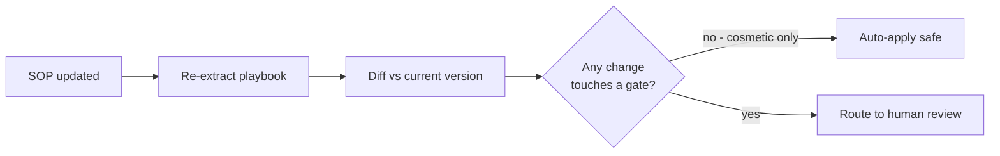

# 8. Dynamic SOPs & sales playbooks — keeping playbooks alive

Two product ideas that turn this from a one-shot converter into a *living* system:

1. **SOPs change** — policies get updated, sometimes often. A playbook generated
   once and never touched goes stale and *wrong*. It should re-sync when the source
   changes.
2. **Not every playbook is a compliance playbook.** **Sales** playbooks are
   dynamic by nature (pricing, promos, competitive plays change weekly) and are
   less about hard legal gates and more about branches and persuasion. The same
   engine should handle them — and auto-sync matters *even more* there.

---

## Part A — Auto-syncing playbooks when the SOP changes
*(`sync.py`)*

### The naive version is dangerous
"When the SOP changes, regenerate the playbook and push it live" sounds great and
is reckless in a regulated flow. What if the regeneration silently dropped the OTP
gate, or the model reworded a mandatory disclosure into something non-compliant?
You'd auto-publish a breach.

### The safe design: re-extract → diff → route
So the real mechanism is a **diff with a routing rule**:



**The routing rule is the whole safety story:**

- **Cosmetic change on a non-gate step** (e.g. reworded guidance on a "collect the
  reason" step) → **safe to auto-apply.** No compliance impact.
- **Any change that touches a compliance gate** — adds/removes a step, changes a
  precondition, a compliance tag, a step type, or a branch → **must go to a human.**

Run it and watch it decide:

```bash
python -m playbook_forge.sync
```

It shows two scenarios:
- *Scenario A:* the SOP reworded a non-gate step → **AUTO-APPLY SAFE**.
- *Scenario B:* the SOP added a new mandatory approval gate → **HUMAN REVIEW
  REQUIRED**, and it points at exactly which steps carry the gate change (`⚠ GATE`).

`tests/test_sync.py` proves both routings, including that removing a gate always
triggers review.

### WHAT / HOW / WHY / IF-WE-DON'T (own it)

- **WHAT.** A diff engine that classifies every change between the old playbook and
  a freshly re-extracted one, and decides whether it's safe to auto-apply.
- **HOW.** Match steps by id; compare fields; mark a change "gate-touching" if
  either version is a gate step or any compliance-sensitive field
  (type/required/compliance_tag/preconditions/branches/next) changed. If anything
  is gate-touching, the whole update routes to a human.
- **WHY.** It delivers the "stays in sync automatically" value **without** the
  "silently changed a legal step" risk. Auto-apply the safe 80%; escalate the
  risky 20%.
- **IF WE DON'T** diff-and-route: you either (a) never auto-update (playbooks drift
  stale and wrong), or (b) blindly auto-update (you ship compliance changes no one
  reviewed). The routing is what makes "dynamic" and "safe" coexist.

### How the "real-time" trigger works (the plumbing)
The diff is the brain; the trigger is the plumbing. In production you'd wire it to:
- a **webhook** from the document system (Confluence/SharePoint/Google Docs) that
  fires on edit, or
- a **scheduled re-check** (nightly) that re-extracts and diffs, or
- a **manual "re-sync" button** for an SOP owner.

The `version` field on `PlaybookMetadata` is the hook that lets you track and diff
versions over time. Each re-sync produces a new version + a change record.

---

## Part B — Sales playbooks (and why the same engine works)

**Sales playbooks** guide reps through a sales motion: qualify the lead, discover
needs, handle objections, branch on buyer type, propose next steps. They're
*dynamic* — pricing, promotions, competitive battlecards, and messaging change
constantly.

### The schema already generalises
Nothing about the schema is card-blocking-specific. A sales playbook is the same
graph of typed steps:
- `verify` → qualify (BANT/MEDDIC checks)
- `collect` → discovery questions
- `inform` → pitch a value prop / share a battlecard
- `branch` → route by buyer persona, objection type, or deal size
- `action` → send a quote, book a demo, create an opportunity in the CRM
- `escalate` → loop in a sales engineer or manager

### The one knob that changes: `regulated`
`PlaybookMetadata.regulated` is the switch. For a compliance playbook it's `True`
and the validator applies strict gate checks (ungated actions flagged, gate
ordering enforced hard). For a **sales** playbook you'd set it `False`: there are
few hard legal gates, so the strict "every action must be gated" checks relax to
warnings, and the emphasis shifts to **branch coverage** (did we handle every buyer
path?) rather than **gate ordering**.

### Why auto-sync matters *more* for sales
Because sales content changes far more often *and* carries far less compliance
risk, a much larger share of sales-playbook updates are "cosmetic / non-gate" and
therefore **safe to auto-apply**. So the exact same diff-and-route engine gives you:
- **Regulated flows:** mostly human-reviewed (safety first, slower cadence).
- **Sales flows:** mostly auto-applied (speed first, human only on structural
  changes like a new branch or a removed step).

One engine, two operating points, controlled by a single flag. That's a clean
platform story for an interview: *"the compliance case and the sales case are the
same product with the strictness dial turned differently."*

### IF WE DON'T generalise
If we hard-coded compliance assumptions everywhere, sales (a much bigger,
faster-moving market) would need a separate build, and we'd have narrowed the
product to only the most conservative buyers. Keeping the core generic — a typed
step graph with a strictness flag — is what lets one engine serve both.

---

## Where this sits on the roadmap

Both of these are natural extensions of the core:
- **Auto-sync (Part A):** built here as `sync.py` (diff + safe routing). The
  production trigger (webhook/schedule) and a change-history UI are the remaining
  V2 work.
- **Sales playbooks (Part B):** supported by the existing schema + `regulated`
  flag; a sales-tuned validator profile and example are the next step.

← Back to start: [`../README.md`](../README.md)
